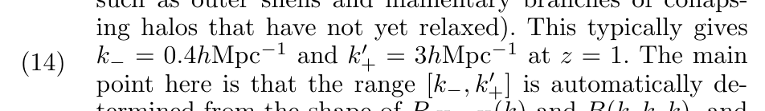

# Notes

## Valageas's Plot

* In this paper, **k** has units: h (Mpc)^(-1).

* Therefore, the power spectrum shown in the figure above has dimensions: (Mpc/h)^3.

## CAMB power spectrum
* We are using `k_hunit = True` and `hubble_units = True` in PK. That gives us the same dimensions as mentioned above.

## Cosmological parameters used in the paper

